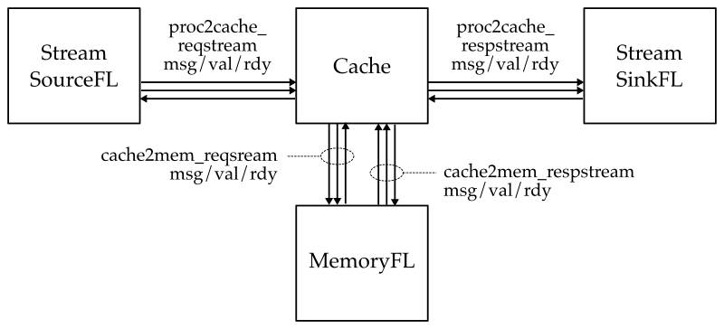
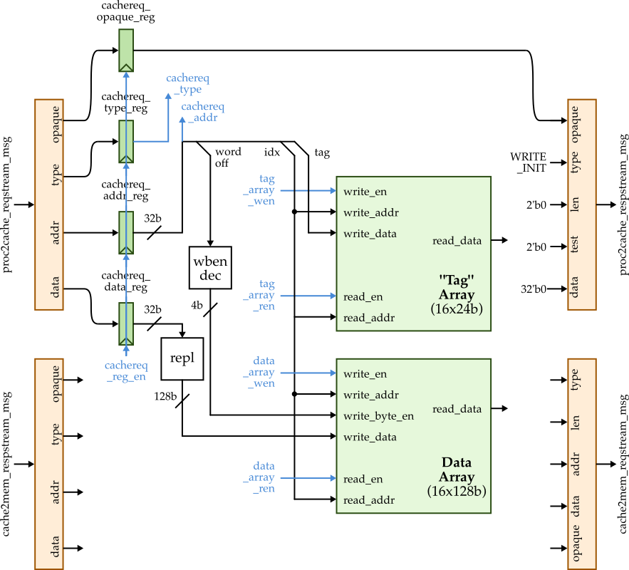
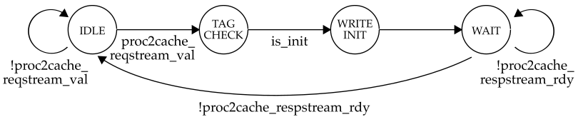

ECE 4750 Section 8: Lab 3 Head Start
==========================================================================

 - Author: Christopher Batten
 - Date: October 21, 2022

**Table of Contents**

 - Cache Walk-Through
 - Using the Cache Functional-Level Model
 - Implementing and Testing Write Init Transaction
 - More Testing

This discussion section serves to introduce students to the basic cache
modeling approach and testing strategy we will be using to implement a
blocking FSM cache in lab 3. You should log into the `ecelinux` servers
using the remote access option of your choice and then source the setup
script.

    % source setup-ece4750.sh
    % mkdir -p $HOME/ece4750
    % cd $HOME/ece4750
    % git clone git@github.com:cornell-ece4750/ece4750-sec08-proc sec08
    % cd sec08
    % TOPDIR=$PWD
    % mkdir $TOPDIR/build

Cache Walk-Through
--------------------------------------------------------------------------

The following figure shows the high-level interface for our cache. The
cache has two memory interfaces. One enables the processor to send memory
requests and receive responses from the cache, and the other enables the
cache to send memory requests and receive responses from main memory. All
interfaces are implemented using the latency-insensitive val/rdy
micro-protocol.

We provide students a trivial functional-level model of a cache which
essentially just directly forwards requests from the processor to main
memory and then directly forwards reponses from main memory back to the
processor. You can find the FL model in `lab3_mem/CacheFL.py`. This is
what the interface looks like in Verilog for an RTL implementation of the
cache.

    module lab3_mem_CacheSimple
    #(
      parameter p_num_banks = 1 // Total number of cache banks
    )
    (
      input  logic          clk,
      input  logic          reset,

      // Processor <-> Cache Interface

      input  mem_req_4B_t   proc2cache_reqstream_msg,
      input  logic          proc2cache_reqstream_val,
      output logic          proc2cache_reqstream_rdy,

      output mem_resp_4B_t  proc2cache_respstream_msg,
      output logic          proc2cache_respstream_val,
      input  logic          proc2cache_respstream_rdy,

      // Cache <-> Memory Interface

      output mem_req_16B_t  cache2mem_reqstream_msg,
      output logic          cache2mem_reqstream_val,
      input  logic          cache2mem_reqstream_rdy,

      input  mem_resp_16B_t cache2mem_respstream_msg,
      input  logic          cache2mem_respstream_val,
      output logic          cache2mem_respstream_rdy
    );

Notice that we are using SystemVerilog structs to encode the memory
requests and responses. Here is the memory request struct format:

     76  74 73           66 65              34 33  32 31               0
    +------+---------------+------------------+------+------------------+
    | type | opaque        | addr             | len  | data             |
    +------+---------------+------------------+------+------------------+

And here is the memory response struct format:

     46  44 43           36 35  34 33  32 31               0
    +------+---------------+------+------+------------------+
    | type | opaque        | test | len  | data             |
    +------+---------------+------+------+------------------+

The baseline implementation for this lab will be a 256B direct-mapped
cache with 16B cache lines and a write-back, write-allocate write policy.
In this discussion section, we provide you a simple cache that partially
implements the write init transaction. The block diagram for how the
datapath unit is shown below.

Here is the FSM for the write init transaction.

Take a look at the code in the following files to learn more about how
the simple cache is implemented.

 - `lab3_mem/CacheSimpleDpath.v`
 - `lab3_mem/CacheSimpleCtrl.v`
 - `lab3_mem/CacheSimple.v`

Using the Cache Functional-Level Model
--------------------------------------------------------------------------

Let's take a look at a basic test for the write init transaction. They
primary way we will test our processors is by writing very small
sequences of memory requests and the expected memory responses. Take a
look at the test in `lab3_mem/test/simple_test.py` to see how to write
such tests.

    def test( cmdline_opts ):

      msgs = [
        #    type  opq  addr    len data                type  opq  test len data
        req( 'in', 0x0, 0x1000, 0, 0xdeadbeef ), resp( 'in',  0x0, 0,   0,  0          ),
      ]

      model = TestHarness( CacheFL(), msgs[::2], msgs[1::2] )

      run_sim( model, cmdline_opts, duts=['cache'] )

We use helper python functions to create the desired memory requests and
expected memory responses. This test has a single write init transaction.
As awlays, you should always make sure your tests pass on the FL model
before using them to test your RTL model. Let's run the above test on our
FL model.

    % cd $TOPDIR/build
    % pytest ../lab3_mem/test/simple_test.py -s

Use the `-s` command line option so you can see the linetrace. Verify
that you can see the stream source sending memory requests to cache which
then forwards those requests to main memory. Also verify that you can see
the corresponding response coming back from main memory to the cache
which then forwards this response back to the stream sink.

Implementing and Testing the Write Init Transaction
--------------------------------------------------------------------------

Let's try the same test on the RTL implementation of the simple cache.
Modify `run_test` to use the `CacheSimple` like this:

    run_sim( CacheSimple, cmdline_opts, duts=['cache'] )

Then rerun the test. The test will not pass since we have not implemented
the write init transaction yet.

The first step is to figure out the address mapping. Find the address
mapping code in the `lab3_mem/CacheSimpleDpath.v`:

    // Address Mapping

    logic  [1:0] cachereq_addr_byte_offset;
    logic  [1:0] cachereq_addr_word_offset;
    logic  [3:0] cachereq_addr_index;
    logic [23:0] cachereq_addr_tag;

    generate
      if ( p_num_banks == 1 ) begin
        // assign cachereq_addr_byte_offset = cachereq_addr[??:??];
        // assign cachereq_addr_word_offset = cachereq_addr[??:??];
        // assign cachereq_addr_index       = cachereq_addr[??:??];
        // assign cachereq_addr_tag         = cachereq_addr[??:??];
      end
      else if ( p_num_banks == 4 ) begin
        // handle address mapping for four banks
      end
    endgenerate

Note that your cache needs to support a four-bank configuration, but this
should be one of the last features you implement. Uncomment and fill in
the `??` to extract the byte offset, word offset, index, and tag from the
cache request address.

The second step is to implement the FSM. Start by implementing the state
transition logic, and then implement the state output table. We have
implemented the IDLE state for you. The seven control signals are shown
in the datapath diagram. The valid bit input and valid write enable
signals in the state output table are used to control the valid bits
which are stored in the control unit.

Once you have implemented the address map, strate transition logic, and
the state output table, rerun our simple test.

    % cd $TOPDIR/build
    % pytest ../lab3_mem/test/simple_test.py -s

You should see a line trace like this:

                                            tag array
                                        -------------------
        cachereq                   state 0   1   2       16                      cacheresp
     1r                           > (I [ - | - | - |...| - ]) > [ ]...>...[  ] >
     2r                           > (I [ - | - | - |...| - ]) > [ ]...>...[  ] >
     3:                           > (I [ - | - | - |...| - ]) > [ ]...>...[  ] >
     4: in:00:00001000:0:deadbeef > (I [ - | - | - |...| - ]) > [ ]...>...[  ] >
     5: .                         > (TC[ - | - | - |...| - ]) > [ ]...>...[  ] >
     6: .                         > (IN[ - | - | - |...| - ]) > [ ]...>...[  ] >
     7: .                         > (W [010| - | - |...| - ]) > [ ]...>...[  ] > in:00:0:0:00000000
     8:                           > (I [010| - | - |...| - ]) > [ ]...>...[  ] >
     9:                           > (I [010| - | - |...| - ]) > [ ]...>...[  ] >
    10:                           > (I [010| - | - |...| - ]) > [ ]...>...[  ] >
    11:                           > (I [010| - | - |...| - ]) > [ ]...>...[  ] >
    12:                           > (I [010| - | - |...| - ]) > [ ]...>...[  ] >

You can see the write init request going into the cache on cycle 4, the
cache transitioning through the I -> TC -> IN -> W states, the tag array
being updated in the IN state, and the write init resopnse being returned
from the cache on cycle 7.

More Testing
--------------------------------------------------------------------------

Add a second write init transaction in the given test case. Use an
address which results in the second write init transaction writing the
second set in the cache. Run the test and verify from the line trace that
the tags in set 0 and set 1 are now valid.

Now add a total of 16 write init transactions. Each transaction should go
to a different set in the cache. Verify the cache is functioning as
expected using the line trace.

