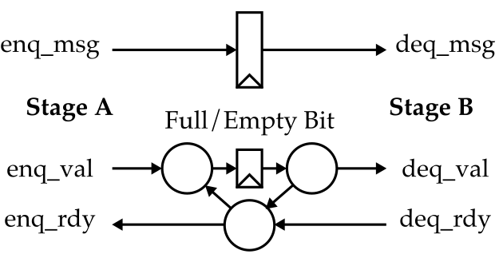

ECE 4750 Section 9: Memory Random Testing and Queues
==========================================================================

 - Author: Christopher Batten
 - Date: October 28, 2022

**Table of Contents**

 - Directed Testing
 - Random Testing for Reads
 - Random Testing for Reads and Writes
 - Queues

In this discussion section, we will work together to develop a random
testing methology for memory systems before spending some time discussing
three different kinds of queues. You should log into the `ecelinux`
servers using the remote access option of your choice and then source the
setup script.

    % source setup-ece4750.sh
    % mkdir -p $HOME/ece4750
    % cd $HOME/ece4750
    % git clone git@github.com:cornell-ece4750/ece4750-sec09-mem-rtest-queues sec09
    % cd sec09
    % TOPDIR=$PWD
    % mkdir $TOPDIR/build

Directed Testing
--------------------------------------------------------------------------

In last week's discussion section, we implemented the write init
transaction in a very basic direct-mapped cache. As always, we will be
using a test-driven design strategy, so it is important for us to begin
thinking about how we will test our cache implementions right from the
beginning. Last week we saw a very basic directed test for the write init
transaction in `lab3_mem/test/simple_test.py`:

    msgs = [
      #    type  opq  addr    len data                type  opq  test len data
      req( 'in', 0x0, 0x1000, 0, 0xdeadbeef ), resp( 'in',  0x0, 0,   0,  0          ),
    ]

Our directed tests will specify the memory request messages along with
the expected memory response messages. Let's run this directed test on
the FL model:

    % cd $TOPDIR/build
    % pytest ../lab3_mem/test/simple_test.py -s

Verify that you can see the stream source sending memory requests to
cache which then forwards those requests to main memory. Also verify that
you can see the corresponding response coming back from main memory to
the cache which then forwards this response back to the stream sink.

Write a new directed test that first uses the write init transaction to
initialize a word, and then uses a read transaction to read that same
word. Verify that this directed test case passes on the cache FL model.

Random Testing for Reads
--------------------------------------------------------------------------

As we know, directed testing is important for verifying known corner
cases, but random testing can help discover unknown corner cases. We have
provided you a basic random testing strategy for testing memory read
requests.

    def data_1KB():
      data = []
      for i in range(256):
        data.extend([0x00001000+i*4,0xabcd1000+i*4])
      return data

    def random_msgs():

      # Create list of 100 random request messages with the corresponding
      # correct response message.

      msgs = []
      for i in range(100):

        # Choose a random index to read

        idx = randint(0,256)

        # Create address and data. Notice how we turn the random index into
        # an actual address. We multiply the index by four and then add it to
        # the base address which is 0x00001000. We can figure out the correct
        # data from the address.

        addr = 0x00001000+idx*4
        data = 0xabcd1000+idx*4

        # Create a request/response pair.

        msgs.extend([
          req( 'rd', i, addr, 0, 0 ), resp( 'rd', i, 0, 0, data ),
        ])

      return msgs

Notice how we need to define _two_ functions. The first function will be
used to initialize the main memory, while the second function is used to
generate the memory requests and expected memory responses. We can
specify these functions along with memory stall probability, memory
latency, and src/sink delays in a test case table similar in spirit to
what we have used in previous labs.

    test_case_table = mk_test_case_table([
      (                 "msg_func     mem_data_func stall lat src sink"),
      [ "random",        random_msgs, data_1KB,     0.0,  0,  0,  0    ],
      [ "random_delays", random_msgs, data_1KB,     0.9,  3,  10, 10   ],
    ])

    @pytest.mark.parametrize( **test_case_table )
    def test( test_params, cmdline_opts ):
      run_test( CacheFL(), test_params, cmdline_opts, cmp_wo_test_field )

You can find the definition of `run_test` in `harness.py`. The
`cmp_wo_test_field` is a function that is used to compare the actual
response message to the expected response message. It enables us to
ignore the test field when running on the FL model since the FL model
always indicates that memory transactions miss in the cache.

Let's run this directed test on the FL model:

    % cd $TOPDIR/build
    % pytest ../lab3_mem/test/simple_random_test.py -s

Verify using the line trace that the test case is producing reads to
random addresses.

Random Testing for Reads and Writes
--------------------------------------------------------------------------

Now let's explore how to extend our random testing strategy to include a
mixture of both reads and writes. Modify the `random_msgs` function so
that there is a 50% chance that every message is a read and a 50% chance
every message is a write. Rerun this random test. We will discuss in the
discussion section how to ensure that such a random test works as
expected.

Queues
--------------------------------------------------------------------------

There are three kinds of queues:

 - Normal Queues : no combinational path from enq to deq, nor from deq to enq
 - Pipe Queues : combinational path from deq rdy to enq rdy
 - Bypass Queues : combinational path from enq val to deq val

Here are the high-level diagrams for each kind of queue.

### Normal Queue (Single Element)

### Normal Queue (Two Element)

### Pipe Queue (Single Element)

### Bypass Queue (Single Element)

We will discuss these queues in the discussion section and also
experiment with RTL implementations of these queues:

    % cd $TOPDIR/build
    % pytest ../lab3_mem/test/NormalQueue1_test.py -s
    % pytest ../lab3_mem/test/NormalQueue2_test.py -s
    % pytest ../lab3_mem/test/PipeQueue1_test.py -s
    % pytest ../lab3_mem/test/BypassQueue1_test.py -s

